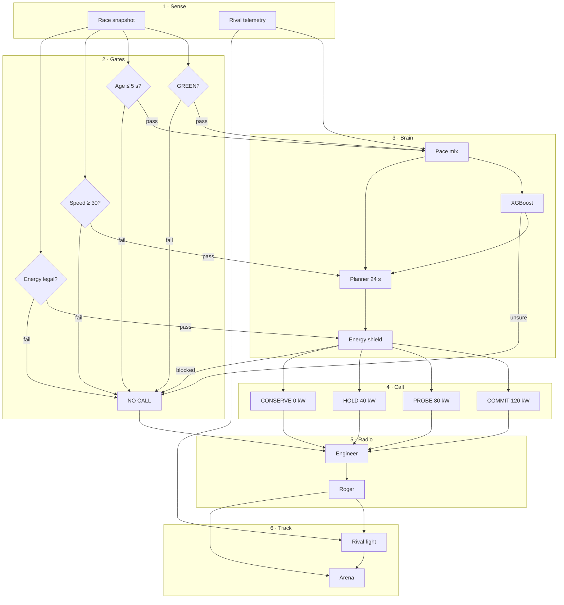

# GridGhost

**Energy intelligence for the next deploy call.**

GridGhost is a pit-wall workspace for the TrackShift *Energy & Overtake Intelligence* theme. It takes **one declared race snapshot** and recommends how much battery to spend in the next few seconds — **COMMIT**, **PROBE**, **HOLD**, or **CONSERVE** — or it says **NO CALL** if the picture is not safe.

It does not drive the car. An engineer still reviews every call.

Visual language is red, white and black, informed by the [public Haas F1 site](https://www.haasf1team.com/). This is an independent prototype. It is not official team software and does not claim any endorsement.

---

## What it is / is not

| It is | It is not |
|---|---|
| A next-call energy advisor | A live timing feed |
| A hybrid of XGBoost + a multi-stage planner + an energy shield | An overtake predictor |
| Auditable gates (flag, data age, reserve) | The rival’s battery |
| A local dashboard you can run without a cloud account | Official FIA software |
| A same-seed lab vs HOLD-if-low and greedy | A full-race optimiser (default horizon is 24 s) |

---

## How a call is made



Failed gates stay on the board as **NO CALL**. The model never skips the energy rules.

---

## The four calls

| Call | Deploy | When |
|---|---|---|
| **COMMIT** | 120 kW | Rival ahead — pass window |
| **PROBE** | 80 kW | Rival behind or attacking — cover |
| **HOLD** | 40 kW | Stay in the fight |
| **CONSERVE** | 0 kW | Save the battery |
| **NO CALL** | none | Flag, age, energy, or confidence is not good enough |

Gap is **lead or lag**, not a proven overtake. Plus = rival ahead. Minus = rival behind.  
**DRS** = Drag Reduction System (rear-wing flap).  
Rival **pace mix** = slower / matched / faster versus our model — not overtake odds, not their battery.

---

## Five rooms

| # | Room | What you do there |
|---|---|---|
| 01 | **Pit wall** | Evaluate the snapshot. Read the next call, forecast, and four-call table. |
| 02 | **Scenario lab** | Same start, three rules: full planner vs HOLD-if-low vs greedy. |
| 03 | **Evidence & history** | Model contract, constraint registry, saved calls, provenance. |
| 04 | **Enter Arena** | Same call on a Silverstone outline. Demo map — not live timing. |
| 05 | **Call flow** | Walk the advisory loop. Play the pit radio. |

---

## Model and accuracy

**GRIDGHOST Tuned Core XGBoost** proposes the first call. The planner scores all four options over a default **24 s** lookahead (6 × 4 s). The energy shield can still block the guess.

| | |
|---|---|
| Task | Multiclass imitation of the V2 planner (teacher policy) |
| Features | 9 — speeds, speed delta, gap, gap rate, energy, energy uncertainty, recovery, recovery uncertainty |
| Rows | **50,000** across **29** source groups |
| Evaluation | 5-fold **grouped** out-of-fold |
| Accuracy | **81.5%** match to the planner (`0.81482`) |
| Macro F1 | **0.784** |
| With abstain | **86.3%** on the **85.2%** of rows it keeps (sits out the hardest **14.8%**) |

Engine labels are ATTACK / DEFEND / HOLD / CONSERVE. The dashboard shows **COMMIT / PROBE / HOLD / CONSERVE**.

This is **teacher-policy match**, not proof of real-race wins. Training rows are synthetic / augmented. Rival battery is never inferred. Demo energy rules are **not** certified FIA clauses.

Exact planner maths: [`docs/MODEL_V2.md`](docs/MODEL_V2.md). Inputs and limits: [`docs/DATA_AND_MODEL.md`](docs/DATA_AND_MODEL.md). Validation: [`docs/VALIDATION.md`](docs/VALIDATION.md).

---

## Quick start

No Node.js, frontend build, API key, or cloud account is required for the synthetic demo.

### Windows (easiest)

1. Clone this repo.
2. Double-click **`START_WINDOWS.bat`** (Python 3.12 + internet for the first install).
3. When you see `Application startup complete`, open **http://127.0.0.1:8000**.
4. Leave the terminal open. Ctrl+C stops the server.

If port 8000 is already taken, start on **8001** (commands below) and open http://127.0.0.1:8001.

### Manual

From the folder that contains this README:

```powershell
py -3.12 -m venv .venv
.\.venv\Scripts\python.exe -m pip install -r requirements-dev.txt
.\.venv\Scripts\python.exe -m uvicorn app.main:app --host 127.0.0.1 --port 8000
```

Linux / macOS: `python3.12 -m venv .venv` and `.venv/bin/python` instead of `.\.venv\Scripts\python.exe`.

---

## Using the dashboard

1. Open `/`. The first synthetic scenario evaluates on load.
2. Pick a dataset (for example **Rival behind**) or edit pace, gap, energy, data age, flag, spare, and lookahead.
3. Click **Evaluate plan**. The big word is the **next call only**.
4. Read **Safer finish** and **Must-keep**, the energy forecast, and the four-call table (including blocked rows).
5. **Save decision** writes the request and result to SQLite. **Export JSON** downloads them.
6. **Next frame** steps the bundled 12-snapshot tape. History is not rewritten by our calls.
7. **Scenario lab → Run comparison** (same seed) compares leftover energy, gap, reserve hits, and call changes.
8. **Enter Arena** plays the same snapshot. Map clock is playback only — it does not change inspector km/h.
9. **Call flow → Walk the call** then **Play radio**.

Import JSON up to 2 MB as `{ "state": ... }`, `{ "states": [...] }` (≤ 2,000 frames), or an exported `{ "request", "result" }`. Ready file: [`data/close_fight_s07.json`](data/close_fight_s07.json).

---

## Verify

Keep the server running. In a second terminal:

```powershell
Invoke-RestMethod http://127.0.0.1:8000/health
.\.venv\Scripts\python.exe -m pytest -q
```

Health should return `status: ok`. The Python suite is **40** tests. Optional: `python -m scripts.demo` and `python -m scripts.benchmark_v2`.

---

## API

Interactive docs: http://127.0.0.1:8000/docs

| Method | Route | Purpose |
|---|---|---|
| GET | `/` | Dashboard |
| GET | `/health` | Liveness |
| GET | `/v2/scenarios` | Labelled synthetic scenarios |
| POST | `/v2/plan` | Multi-stage plan; `?save=true` persists |
| POST | `/v2/compare` | Seeded closed-loop comparison |
| GET | `/v2/history` | Saved evaluations (`limit` 1–100) |
| GET | `/openapi.json` | Schema |

`/v1/...` endpoints remain (replay, CSV, stored runs).

No API key is set by default. To require one:

```powershell
$env:API_KEY="your-own-long-random-secret"
$env:DATABASE_PATH="data/strategy.sqlite3"
```

Enter the key in the dashboard dialog. It stays in page memory, not localStorage.

---

## Limits we state in public

- Bundled snapshots are **synthetic**. OpenF1 can supply speeds and gaps; **energy stays simulated**.
- No live rival battery, no tyre / fuel / aero model, no circuit-geometry overtake proof.
- Planner search is bounded and approximate — not a proof of the global best plan.
- Closed-loop lab uses a related synthetic plant, not independent real-world validation.
- This release builds on an earlier AI-assisted backend prototype. Disclose reuse if the event requires it. See [`docs/CHALLENGE_ALIGNMENT.md`](docs/CHALLENGE_ALIGNMENT.md).

---

## Troubleshooting

| Symptom | What to do |
|---|---|
| `.venv\Scripts\python.exe` missing | Create the venv from this folder first |
| `Address already in use` | Stop the other process or use `--port 8001` |
| `NO_RECOMMENDATION` / **NO CALL** | Read the reason — flag, stale data, or energy gate |
| `401` | Enter the configured API key, or leave blank for the default demo |
| `422` | Input failed the schema — read the field error |
| Swagger blank offline | `/docs` needs the CDN; the dashboard assets are local |

---

Advisory only. Engineer review before any real call.
